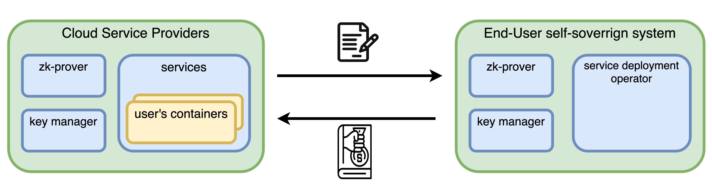

# zk-agreement

## Overview

The zk-agreement is a zero-knowledge protocol that enables two parties to reach a service agreement (for example, an SLA to host a Docker container in the cloud) without revealing the details within the agreement. Additionally, it offers a mechanism to prevent either party from violating the agreement. There will also be third-party oracles to monitor the validity of the behavior of both parties.


## Research Problems

1. What problems can Zero-Knowledge Proofs (ZKP) solve in private agreements?
2. To what extent can ZKPs provide privacy in private agreements?
3. How can it be verified that both parties act in good faith?
4. How can it be verified that one of the bad parties act in bad faith?
5. How to design the crypto protocol for a private agreement?

## Blockchain and Smart Contracts

Reasons for the protocol to have blockchain:

1. **public verification of Proofs of Agreement**: Blockchain allows the ZKP of proofs of agreement to be verified
2. **smart Contracts are unstoppable and deterministic**: Once deployed, smart contracts execute exactly as programmed without any possibility of downtime, censorship, fraud, or third-party interference.
3. **eryptographic guaranteed trust between two parties**: By anchoring the agreement in a blockchain, both parties can trust that the agreement cannot be altered retroactively without mutual consent. This trust is not based on the reputation or promises of either party but on the immutable and transparent nature of the blockchain, where all transactions and agreements are permanently recorded and verifiable.
4. **integration with oracles for real-world data**: Blockchain oracles can be used to securely feed real-world data into the blockchain to trigger agreement conditions encoded in smart contracts. This capability allows for dynamic agreements that can adapt to external conditions or events, enhancing the flexibility and applicability of the zk-agreement protocol to a wide range of use cases.

## Zero Knowledge Proofs

Reasons for the protocol to use Zero Knowledge Proofs:

1. **preserves privacy**: ZKP allows the two parties involved in an agreement (e.g., hosting a Docker container in the cloud) to verify the compliance with the terms without revealing the specific details of the agreement to each other or to third parties.

2. **reduces on chain data**: By compressing off-chain agreement data and code, ZKP minimizes the need for extensive on-chain storage.

3. **enhances trust**: Through the use of third-party oracles to monitor the validity of both parties' behavior, ZKP enables trust in the agreement's enforcement without requiring the oracles to have direct access to the agreement's contents.
4. **prevents violations**: ZKP provides a mechanism to detect and prevent one party from violating the agreement.

5. **facilitates dispute resolution**: Through crypto protocol design, ZKP could allow for verification of claims related to the agreement without exposing its specifics to the adjudicating authority.

## Public Informations

possible public data:

- (could be private) identity of party A, **cloud service provider**
- (could be private) identity of party B, **end users**
- public contents in terms of a service agreement
  - service description
  - service avaiablilities
  - general terms and conditions
  - service level objectives
    - uptime percentage
    - response times

## Circuits

possible private inputs:

- private contents in terms of a service agreement
  - pricing information
  - custom services (hard to quantify)
  - performance metrics
    - exact metrics, penalties, and bonuses related to the performance of specific services
  - security protocols
  - data privacy agreements (hard to quantify)
  - dispute resolution and termination procedures (hard to quantify)
- service nullifier: differentiating both parties could set up multiple services, but these services are unique

possible public inputs:

- identity of party A
- identity of party B
- pre-image of public parts within service agreement
- pre-image of the crypto protocol for signing the service agreemt

## Service Agreement Order Book

```json=
{
    "order": {
        "signature": {
            "signatureType": 3,
            "r": "0xdbec3b59729d24549ba120d473ae6838bb38ea73a02837a776e2f395e8708094",
            "s": "0x33fbecf9484a4c29bea206db655da78c9c9cd502707c71a15dff71841f55c310",
            "v": 27
        },
        "maker": "0x56eb0ad2dc746540fab5c02478b31e2aa9ddc38c", // party A
        "taker": "0x0000000000000000000000000000000000000000", //party B
        "makerServiceHash": "0xfd9664b2b06837d2a629299e2ff2eea0b8136d5719602f25c506dfe1917ec2c5",
        "takerAmount": "10000000",
        "takerToken": "0xa0b86991c6218b36c1d19d4a2e9eb0ce3606eb48",
        "salt": "40584472803756371677282334946406041345967204972423156532532776379801646390127",
        "verifyingContract": "0xdef1c0ded9bec7f1a1670819833240f027b25eff",
        "expiry": "1614959239",
    },
    "metaData": {
        "orderHash": "0xe4b47eb16a24c7e2de185e64ad9234b13052f1f60a0a7c108f3ec0feec3cf8ac",
        "createdAt": "2021-03-05T15:32:18.473Z"
    }
}
```

## Next Steps

1. design the crypto protocol for two parties to sign an agreement
2. provide a circuit template
3. provide a PoC code for service agreement
4. Keep refactoring the problem and possible solutions
