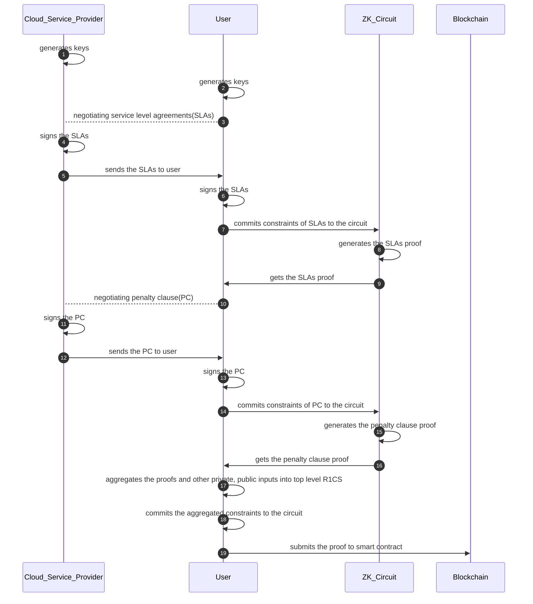
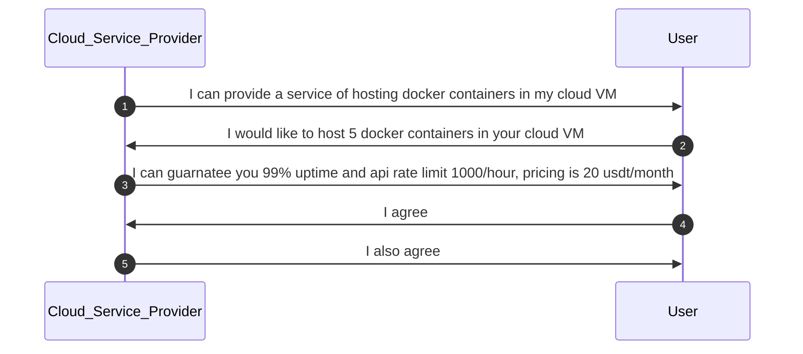
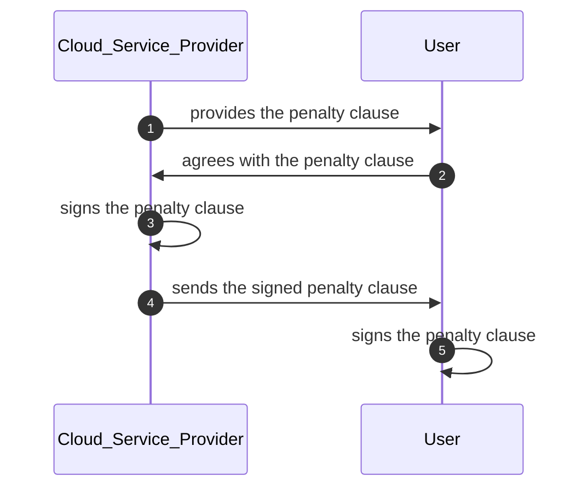

# Sequence diagram

## Core Flow

### Description

This flow describes a process involving a user and a cloud service provider (CSP) negotiating service level agreements (SLAs) and penalty clauses (PC) within a blockchain context, utilizing Zero-Knowledge (ZK) circuits for proof generation. Here's a simplified explanation:

Both the CSP and the user generate their keys.
The user negotiates service level agreements (SLAs) with the CSP. Once agreed upon, both parties sign the SLAs.
The CSP sends the signed SLAs to the user, who then commits the constraints of these SLAs to a ZK circuit. The ZK circuit generates a proof for the SLAs, which the user receives.
Following the SLAs, the user and CSP negotiate a penalty clause (PC) for any breaches of the agreement. Both parties sign the PC, and the CSP sends it to the user.
The user commits the constraints of the PC to the ZK circuit, which then generates a proof for the PC. The user receives this proof as well.
The user aggregates these proofs along with other private and public inputs into a top-level Rank-1 Constraint System (R1CS). They commit the aggregated constraints to the circuit.
Finally, the user submits the proof to a smart contract on the blockchain.

### Sequence Diagram

## SLA negotiation

### Overview

#### Parties Involved:

- Cloud Service Provider (CSP):
- User (USR)

#### Service Description:

The CSP agrees to provide hosting services for Docker containers within their cloud VM infrastructure.

#### Service Scope:

Number of Docker Containers: The CSP will host 5 Docker containers for the USR.
Service Levels:

1. Uptime percentage: The CSP guarantees an uptime of 99% for the hosted Docker containers.
2. Available time percentage: The CSP guarantees an uptime of 99% for the hosted Docker containers.
3. API rate limit: The CSP assures an API rate limit of 1000 requests hour.

#### Pricing:

The service is priced at 20 USDT (United States Dollar Tether) per month.

### Sequence Diagram

## Penalty Clause negotiation

### Service Commitments:

The Service Provider guarantees a monthly uptime of 99.5% and an API rate limit of 100,000 requests per day for the service subscribed by the Client. The pricing for the said service is set at 20 USDT (United States Dollar Tether) per month.

### Penalty Provisions:

In the event that the Service Provider fails to meet the guaranteed monthly uptime of 99.5% or the daily API rate limit of 100,000 requests, a penalty shall be imposed as compensation to the Client. This penalty will be calculated in a linear relation to the shortfall from the guaranteed service levels and the monthly service fee.

### Penalty Calculation:

#### For uptime below the guaranteed 99.5%, the penalty will be calculated as follows:

For every 0.1% (or part thereof) below the guaranteed uptime level, a penalty of 2% of the monthly service fee (20 USDT) will be credited to the Client's next billing cycle.

#### For API requests below the guaranteed limit of 100,000 requests per day, the penalty will be calculated as follows:

For every 1,000 requests (or part thereof) below the guaranteed limit, a penalty of 0.2% of the monthly service fee (20 USDT) will be credited to the Client's next billing cycle.

### Penalty Cap:

The total penalty credited in any given month shall not exceed 50% of the monthly service fee (i.e., 10 USDT).

### Sequence Diagram

