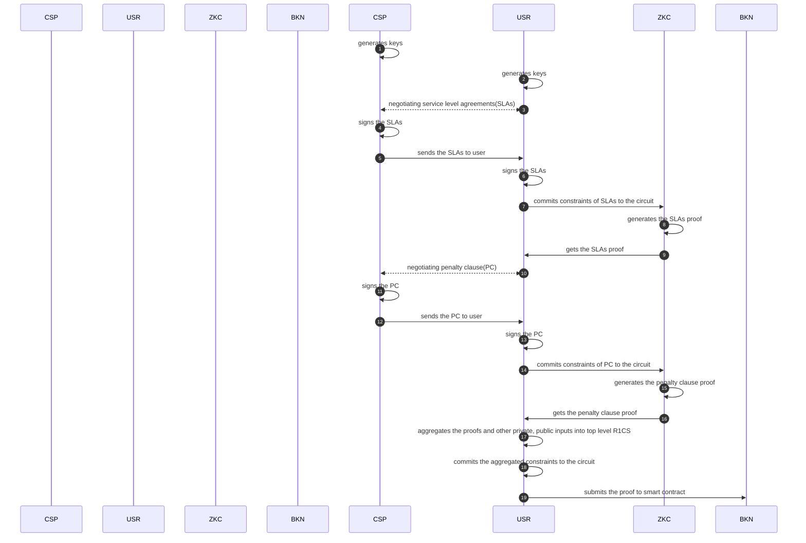

# Sequence diagram

## component interaction



## SLA negotiation

```mermaidjs
sequenceDiagram
autonumber

participant Cloud_Service_Provider as CSP
participant User as USR

CSP ->> USR: I can provide a service of hosting docker containers in my cloud VM
USR ->> CSP: I would like to host 5 docker containers in your cloud VM
CSP ->> USR: I can guarnatee you 99.5% uptime and api rate limit 100000/day, pricing is 20 usdt/month
USR ->> CSP: I agree
CSP ->> USR: I also agree

```

## Penalty Clause

### Service Commitments:

The Service Provider guarantees a monthly uptime of 99.5% and an API rate limit of 100,000 requests per day for the service subscribed by the Client. The pricing for the said service is set at 20 USDT (United States Dollar Tether) per month.

### Penalty Provisions:

In the event that the Service Provider fails to meet the guaranteed monthly uptime of 99.5% or the daily API rate limit of 100,000 requests, a penalty shall be imposed as compensation to the Client. This penalty will be calculated in a linear relation to the shortfall from the guaranteed service levels and the monthly service fee.

### Uptime Penalty Calculation:

#### For uptime below the guaranteed 99.5%, the penalty will be calculated as follows:

For every 0.1% (or part thereof) below the guaranteed uptime level, a penalty of 2% of the monthly service fee (20 USDT) will be credited to the Client's next billing cycle.
API Rate Limit Penalty Calculation:

#### For API requests below the guaranteed limit of 100,000 requests per day, the penalty will be calculated as follows:

For every 1,000 requests (or part thereof) below the guaranteed limit, a penalty of 0.2% of the monthly service fee (20 USDT) will be credited to the Client's next billing cycle.

### Penalty Cap:

The total penalty credited in any given month shall not exceed 50% of the monthly service fee (i.e., 10 USDT).

### Sequence Diagram

```mermaid

autonumber

participant Cloud_Service_Provider as CSP
participant User as USR

CSP ->> USR: provides the penalty clause
USR ->> CSP: agrees with the penalty clause
CSP ->> CSP: signs the penalty clause
CSP ->> USR: sends the signed penalty clause
USR ->> USR: signs the penalty clause

```
